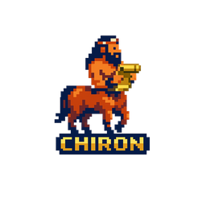
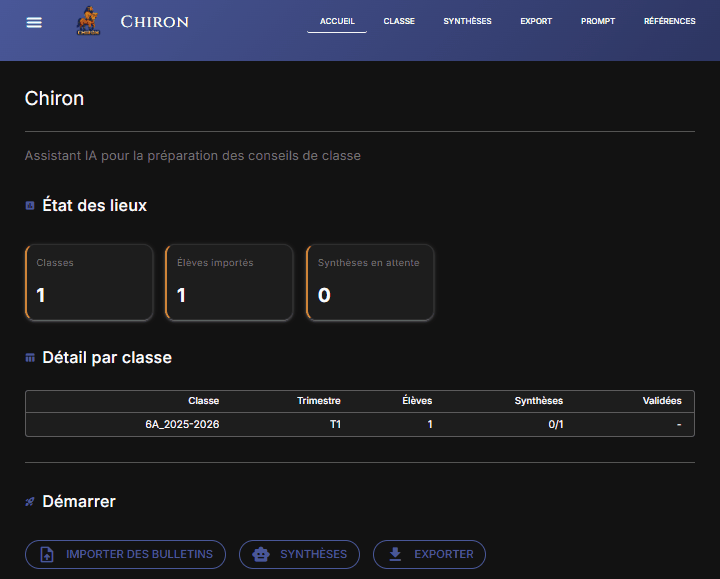

<p align="center">
  
</p>

<h1 align="center">Chiron</h1>

[](https://github.com/fdayde/chiron/actions/workflows/ci.yml)
[](https://codecov.io/gh/fdayde/chiron)
[](https://www.python.org/downloads/)
[](#statut-du-projet)
[](https://github.com/astral-sh/ruff)
[](https://duckdb.org/)

Assistant IA responsable pour la préparation des conseils de classe. Suggère des projets de synthèses trimestrielles à partir des bulletins scolaires (PDF PRONOTE) pseudonymisés, l'enseignant relit, ajuste et valide chaque synthèse.

<!-- TODO: remplacer par le chemin réel du GIF -->
<p align="center">
  
</p>

## Sommaire

- [Fonctionnalités clés](#fonctionnalités-clés)
- [Statut du projet](#statut-du-projet)
- [Vue d'ensemble](#vue-densemble)
- [RGPD — À lire avant utilisation](#rgpd--à-lire-avant-utilisation)
- [Utilisation](#utilisation)
- [Développement](#développement)
- [Structure du projet](#structure-du-projet)
- [Sécurité & RGPD](#sécurité--rgpd)
- [Stack technique](#stack-technique)
- [Documentation](#documentation)
- [Contribuer](#contribuer)
- [Licence](#licence)

## Fonctionnalités clés

### Pseudonymisation avant envoi cloud
Les noms, prénoms et informations identifiantes sont détectés par une pipeline 3 passes locale (regex + Flair NER fuzzy + fuzzy direct) et remplacés par des pseudonymes (`ELEVE_001`) **avant tout envoi au cloud**. Le LLM ne reçoit jamais de données nominatives. Les noms réels sont restaurés automatiquement à l'export.

### Few-shot learning : calibration par l'enseignant
L'enseignant peut marquer jusqu'à 3 synthèses validées comme « exemples » pour l'IA. Ces exemples sont automatiquement injectés dans le prompt (few-shot) afin de calibrer le style, le ton et le niveau de détail des synthèses suivantes. Les appréciations sont tronquées et les synthèses plafonnées à 1000 caractères pour maîtriser la taille du prompt.

### Insights pédagogiques fondés sur la recherche
L'outil propose des signaux factuels et des pistes de travail, sans profilage ni catégorisation, fondés sur la recherche en éducation :
- **Growth mindset** (Dweck, 2006) : valorisation des processus, pas des capacités fixes
- **Feedforward** (Hattie & Timperley, 2007) : orientation prospective vers des stratégies concrètes
- **Détection des biais de genre** : identification automatique des formulations genrées dans les appréciations

## Statut du projet

**Phase actuelle** : Bêta fonctionnelle — packaging `.exe` disponible
- Pipeline complet : PDF → Pseudonymisation → Extraction → Génération LLM → Export
- UI NiceGUI (navigateur) : import, génération, calibration few-shot, validation, export
- API FastAPI intégrée (process unique)
- RGPD : pseudonymisation NER locale avant envoi cloud
- Multi-provider : Mistral (défaut), OpenAI, Anthropic
- Distribution : `chiron.exe` (PyInstaller, `--onedir`)

## Vue d'ensemble

```
PDF PRONOTE → Pseudonymisation → Extraction → Calibration → Génération LLM → Validation → Export
     │              │                  │            │               │             │           │
     │         Flair NER         YAML template  Few-shot       Mistral (cloud) Humain    Dépseudo
     │         (local)           (local)        (0-3 ex.)      hébergé UE     (local)    (local)
     ▼              ▼                  ▼            ▼               ▼             ▼           ▼
  Bulletin    PDF pseudonymisé   Données      Exemples        Synthèse      Validée    Noms réels
```

## RGPD : À lire avant utilisation

Chiron s'inscrit dans une démarche de privacy by design, et propose un cadre responsable à l'usage de l'IA générative
pour la rédaction de synthèses scolaires. L'outil ne note pas, ne classe pas et ne catégorise pas les élèves, il produit des suggestions de textes soumis au jugement de l'enseignant.

Chiron **pseudonymise toutes les données** (noms → `ELEVE_XXX`, notes → niveaux LSU) avant envoi à l'API Mistral AI. Le LLM ne reçoit jamais de données nominatives.

**Mistral AI** est une société française 🇫🇷, hébergée en UE, soumise au RGPD ([DPA](https://legal.mistral.ai/terms/data-processing-addendum)).

### Avant d'utiliser Chiron, vous devez :

1. **Informer votre chef d'établissement** et obtenir son accord (c'est lui le responsable de traitement RGPD)
2. **Désactiver l'entraînement** dans votre [console Mistral](https://console.mistral.ai/) : Admin Console > Privacy > off
3. **Supprimer les données** après chaque conseil de classe (page Export de Chiron)

> Le chef d'établissement peut consulter le DPO académique. Le [DPA Mistral](https://legal.mistral.ai/terms/data-processing-addendum) et cette documentation fournissent les éléments nécessaires.

Pour le détail technique des données traitées, voir [Sécurité & RGPD](#sécurité--rgpd).

## Utilisation

### Installation

1. Télécharger le dossier `chiron/` (fourni par le développeur ou via [Releases](https://github.com/fdayde/chiron/releases))
2. Renommer `.env.example` en `.env` et renseigner votre clé API Mistral :
   ```env
   MISTRAL_API_KEY=votre-clé-ici
   ```
3. Double-cliquer sur `chiron.exe`

### Configuration (.env)

```env
# Provider par défaut : Mistral (hébergé en UE, conforme RGPD)
DEFAULT_PROVIDER=mistral
MISTRAL_API_KEY=...

# OpenAI et Anthropic disponibles en configuration avancée :
# OPENAI_API_KEY=sk-...
# ANTHROPIC_API_KEY=sk-ant-...
# DEFAULT_PROVIDER=openai  (ou anthropic)
```

Options avancées (développeurs) : voir [.env.example](.env.example).

### Workflow type

1. **Classe** : Importer les PDF bulletins de la classe (pseudonymisation automatique)
2. **Vérification** : Utilisez le bouton « Visualiser les zones » pour vérifier que l'extraction du bulletin est correcte
3. **Génération** : Générer 1-2 synthèses, relire et modifier au besoin, et valider
4. **Calibration** : Marquer 1 à 3 synthèses validées comme exemples pour l'IA
5. **Batch** : Générer les synthèses restantes (calibrées par les exemples)
6. **Review** : Relire, éditer si besoin, valider
7. **Export** : Copier les synthèses dans le presse-papiers (noms réels restaurés automatiquement)

## Développement

### Prérequis

- Python 3.13+
- [uv](https://github.com/astral-sh/uv)
- Clé API Mistral ([créer un compte](https://console.mistral.ai/))

### Installation

```bash
git clone https://github.com/fdayde/chiron.git
cd chiron

uv venv
# Windows
.venv\Scripts\activate
# Linux/MacOS
source .venv/bin/activate

uv sync --group dev

cp .env.example .env
# Éditer .env avec vos clés API
```

### Démarrage rapide

```bash
python run.py
```

Le navigateur s'ouvre sur http://localhost:8080.

Options :
```bash
CHIRON_NATIVE=1 python run.py    # Mode desktop (pywebview)
CHIRON_PORT=9000 python run.py   # Port personnalisé
```

### Tests

```bash
uv run pytest
```

### Build .exe

Pour distribuer l'application sans installer Python :

```bash
# Installer les outils de build
uv pip install pyinstaller pyinstaller-hooks-contrib

# Construire
python scripts/build.py --clean
```

Le dossier `dist/chiron/` contient tout le nécessaire.

## Structure du projet

```
chiron/
├── src/
│   ├── api/                  # Backend REST FastAPI
│   │   ├── main.py           # App FastAPI + lifespan
│   │   ├── dependencies.py   # Injection de dépendances
│   │   └── routers/          # classes, élèves, synthèses, exports
│   ├── core/                 # Transverse
│   │   ├── constants.py      # Chemins, année scolaire
│   │   ├── models.py         # Modèles Pydantic
│   │   └── exceptions.py     # Exceptions custom
│   ├── document/             # Parsing PDF
│   │   ├── yaml_template_parser.py # Parser principal (template YAML configurable)
│   │   ├── anonymizer.py          # Extraction nom élève
│   │   ├── pseudonymization.py   # Pipeline 3 passes (regex + Flair NER + fuzzy)
│   │   ├── validation.py          # Validation post-extraction + mismatch classe
│   │   ├── debug_visualizer.py    # PDF annoté pour debug visuel
│   │   └── templates/             # Templates YAML d'extraction (pronote_standard)
│   ├── generation/           # Génération synthèses
│   │   ├── generator.py      # SyntheseGenerator
│   │   ├── prompts.py        # Templates de prompts versionnés
│   │   └── prompt_builder.py # Formatage données pour le prompt
│   ├── llm/                  # Abstraction LLM multi-provider
│   │   ├── manager.py        # LLMManager (registry, retry, rate limiting)
│   │   ├── config.py         # Settings (clés API, modèles, pricing)
│   │   ├── base.py           # LLMClient ABC (template method)
│   │   ├── rate_limiter.py   # SimpleRateLimiter (fenêtre glissante RPM)
│   │   ├── pricing.py        # PricingCalculator (calcul de coûts)
│   │   └── clients/          # OpenAI, Anthropic, Mistral
│   ├── privacy/              # Pseudonymisation RGPD
│   │   └── pseudonymizer.py  # Mapping nom <-> ELEVE_XXX
│   └── storage/              # Persistance DuckDB
│       ├── connection.py     # Connexion DuckDB
│       ├── schemas.py        # Définitions des tables SQL
│       └── repositories/     # CRUD (classes, élèves, synthèses)
├── app/                      # Frontend NiceGUI
│   ├── layout.py             # Layout partagé (header, sidebar)
│   ├── config_ng.py          # Settings UI (providers, coûts)
│   ├── cache.py              # Cache TTL
│   ├── state.py              # Gestion d'état
│   ├── pages/                # home, import, synthèses, export, prompt
│   └── components/           # eleve_card, synthese_editor, llm_selector...
├── tests/                    # Tests (pseudonymisation, suppression, validation, parsing PDF)
├── run.py                    # Point d'entrée unique (API + UI)
├── chiron.spec               # Spec PyInstaller
├── scripts/build.py          # Script de build .exe
├── data/
│   └── db/                   # DuckDB (chiron.duckdb, privacy.duckdb)
└── docs/                     # Documentation technique
```

## Sécurité & RGPD

| Aspect | Mesure |
|--------|--------|
| **Fail-safe à l'import** | Si le PDF ne correspond pas au format attendu (nom non détecté, aucune matière), l'import est **bloqué** : aucune donnée n'atteint le LLM |
| **Pseudonymisation** | Pipeline 3 passes : regex + Flair NER fuzzy + fuzzy direct **avant** envoi cloud (ELEVE_XXX) |
| **Stockage local** | DuckDB fichier local, pas de cloud |
| **Mapping identités** | Base séparée (`privacy.duckdb`), cascade suppression |
| **LLM cloud** | Reçoit uniquement données **pseudonymisées** |
| **Validation humaine** | Obligatoire avant export |
| **Effacement automatique (30j)** | Données expirées supprimées au lancement (Art. 5(1)(e)) |
| **Suppression manuelle** | Suppression données + mappings après export (page Export) |
| **Base légale** | Mission de service public éducatif (RGPD Art. 6(1)(e)) |
| **Code source ouvert** | Auditable ([Apache 2.0](LICENSE)) |

### Détail des données personnelles

| Donnée | Traitement |
|--------|------------|
| Nom, prénom | Pseudonymisé (ELEVE_XXX) avant envoi à l'IA |
| Appréciations enseignantes | Transmises pseudonymisées à l'IA |
| Moyennes par matière | Catégorisées selon l'échelle de maîtrise du socle commun (LSU) avant envoi à l'IA |
| Genre (F/G) | **non extrait** : le LLM déduit le genre depuis les accords grammaticaux des appréciations |
| Absences, retards | Stocké localement, **non transmis** |
| Engagements (délégué...) | Stocké localement, **non transmis** |
| Nom des professeurs | Stocké localement, **non transmis** |
| Établissement | Stocké localement, **non transmis** |
| Classe (niveau, groupe) | Stocké localement, **non transmis** |
| Année scolaire | Stocké localement, **non transmis** |
| Trimestre | Stocké localement, **non transmis** |

## Stack technique

| Composant | Technologie |
|-----------|-------------|
| Runtime | Python 3.13+ |
| LLM | Mistral (défaut) — OpenAI, Anthropic disponibles en configuration avancée |
| NER | Flair NER (flair/ner-french) + rapidfuzz |
| PDF | pdfplumber + YAML templates (configurable) |
| Backend | FastAPI + Uvicorn |
| Frontend | NiceGUI |
| Base de données | DuckDB (local) |
| Packaging | PyInstaller (`--onedir`) |

## Documentation

- **[docs/architecture.md](docs/architecture.md)** — Architecture, flux de données, RGPD
- **[docs/adapter-format-bulletin.md](docs/adapter-format-bulletin.md)** — Adapter Chiron à un autre format de bulletin (autre que PRONOTE)
- **[docs/references.md](docs/references.md)** — Fondements scientifiques (Dweck, Hattie & Timperley, Ryan & Deci, IPP)
- **[docs/fiche_technique_rgpd.md](docs/fiche_technique_rgpd.md)** — Informations utiles pour rédiger l'AIPD et la note d'information aux familles dans le cadre du RGPD.

## Contribuer

Les contributions sont bienvenues. Pour commencer :

1. Forker le projet et créer une branche (`git checkout -b feat/ma-feature`)
2. Installer l'environnement de développement (voir [Développement](#développement))
3. Lancer les tests (`uv run pytest`) et le linter (`uv run ruff check`)
4. Ouvrir une Pull Request

Pour signaler un bug ou proposer une fonctionnalité, ouvrir une [issue](https://github.com/fdayde/chiron/issues).

## Licence

[Apache License 2.0](LICENSE)
